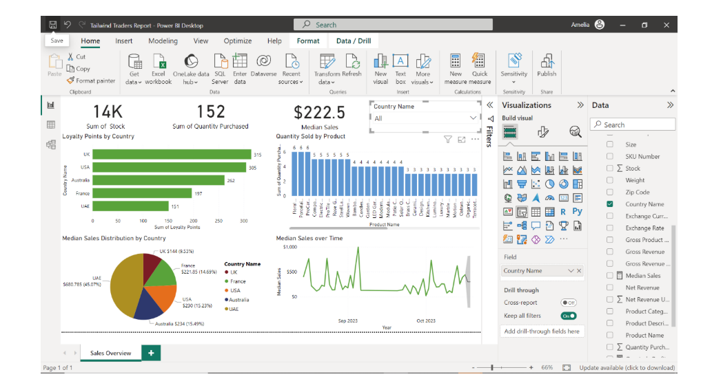

# 🛒 Tailwind Traders: Executive Sales & Profit Dashboard 

This project showcases an end-to-end business intelligence solution for **Tailwind Traders**, built using Microsoft Power BI. It replicates the kind of data challenges faced by real-world organizations and demonstrates how to address them through data transformation, model design, advanced DAX, and dashboarding — aligned with the **Meesho Data Scientist – I** job description.

---

##  Business Objective

Tailwind Traders required a set of strategic dashboards to:

- Analyze global **sales**, **profits**, and **returns** across regions and products
- Enable **data-driven decisions** for revenue growth and cost control
- Provide executives with **mobile-ready performance summaries**
- Deliver **automated alerts and insights** for ongoing monitoring

---

##  Tech Stack

| Tool          | Purpose                                      |
|---------------|----------------------------------------------|
| **Power BI**  | Core data modeling, DAX measures, dashboarding |
| **Python (pandas)** | Data parsing for historical currency rates |
| **DAX**       | Time-based calculations (YTD, QTD, MEDIAN)   |
| **Excel**     | Source dataset preparation                   |

---

##  Features & Deliverables

###  Case Study Implementations:

   ### 1. **Sales Data Report**
- Loaded structured `.xlsx` file into Power BI
- Calculated:
  - **Gross Revenue** = \$11,318
  - **Net Revenue** = \$12,137
  - **Delta (Tax impact)** = Net – Gross = \$819
- Used Power Query to ensure column quality, data types, and validation
- Prepared for further aggregation in unified USD model

2. **Data Preparation & Optimization**
   - Purchase, Country & Exchange data types validated
   - Applied **Python script** for exchange rate transformation

3. **Currency Normalization**
   - Created `Sales in USD` fact table using relationships + DAX
   - Implemented normalized reporting across geographies

4. **Profitability Insights**
   - Calculated:
     - Yearly Profit Margin
     - Quarterly Profit
     - YTD Profit
     - Median Sales
   - Leveraged `DATESQTD()` and `TOTALYTD()` DAX functions

5. **Executive Dashboard**
   - Dual-page report: *Sales Overview* + *Profit Overview*
   - Created `CalendarTable` for time intelligence
   - Added card visuals, pie/bar/line charts
   - Pinned to **mobile-optimized dashboard**

6. **Monitoring Tools**
   - Setup **Power BI Subscriptions** for weekly profit/sales reports
   - Used **Performance Analyzer** to optimize visuals

---

## Visual Snapshots

> _Screenshots from actual Power BI implementation are available in the `/assets` folder._

| Sales Overview | Profit Overview |
|----------------|------------------|
|  |  |

---

## 📂 Folder Structure

