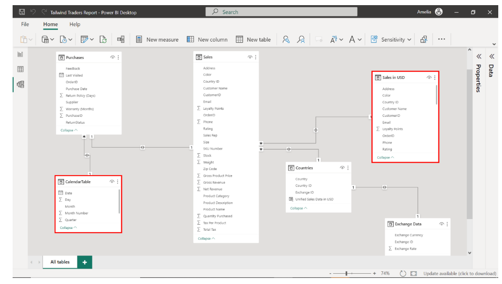

# Tailwind Traders Executive BI Dashboard 

This repository showcases a complete data-driven business intelligence solution for **Tailwind Traders**, built using Microsoft Power BI and Python. The goal was to transform raw sales and financial data into actionable insights for executive decision-making.

---

##  Business Objective

Tailwind Traders required:
- Global analysis of **sales**, **profits**, and **returns**
- Currency normalization and country-wise performance
- Temporal insights: **Yearly**, **Quarterly**, **YTD**
- Automated dashboards with **subscriptions**, **mobile layout**, and **alerts**

---

## Key Case Studies & Implementations

---

### 1. **Sales Data Report**

- Imported structured `.xlsx` dataset into Power BI
- Cleaned and validated data using Power Query
- Calculated:
  - **Gross Revenue** = \$11,318
  - **Net Revenue** = \$12,137
  - **Tax Impact (Delta)** = \$819
- Ensured column profiling, histogram analysis, and type assignment

  


---

### 2. **Data Preparation & Exchange Rate Transformation**

- Prepared and optimized the following:
  - Purchases table
  - Countries + Exchange Rate mapping
- Used **Python script** in Power BI to parse and structure currency data:

```python
import pandas as pd
from io import StringIO

data = """Exchange ID;ExchangeRate;Exchange Currency
1;1;USD
2;0.75;GBP
3;0.85;EUR
4;3.67;AED
5;1.3;AUD"""

df = pd.read_csv(StringIO(data), sep=';')
df
```
---

### 3. **Star Schema & Currency Normalization**

A robust star schema was designed in Power BI to support clean relationships, efficient querying, and scalable DAX calculations.

####  Fact Tables
- **Sales** – raw sales data including gross price, quantity, and product details
- **Sales in USD** – currency-adjusted sales data using exchange rates

####  Dimension Tables
- **CalendarTable** – auto-generated using DAX for time intelligence
- **Countries** – maps each customer region to its currency and exchange ID
- **Exchange Data** – structured currency conversion table
- **Purchases** – product-level metadata including returns, warranties, and suppliers

All relationships were set with correct **cardinality** and **filter directions** for optimal model performance.

 *Data Model View*  


---

### 4. **Profitability Metrics with Advanced DAX**

Implemented key financial insights using **custom DAX measures** to support strategic analysis across time horizons:

####  Measures Created
- **Yearly Profit Margin**  
  `Yearly Profit Margin = DIVIDE([Gross Revenue], [Net Revenue])`

- **Quarterly Profit**  
  Used `DATESQTD()` to segment profit by fiscal quarters

- **Year-to-Date (YTD) Profit**  
  Used `TOTALYTD()` to aggregate sales from the start of the year  
  `YTD Profit = TOTALYTD([Net Revenue], 'CalendarTable'[Date])`

- **Median Sales**  
  Calculated using statistical DAX function:  
  `Median Sales = MEDIAN('Sales in USD'[Gross Revenue])`

####  Optimization
- Used the **Performance Analyzer** to monitor DAX query time for card visuals
- Ensured all metrics were below 200ms rendering time

 *YTD Profit, KPIs, and DAX Cards*  


---
### 5. **Executive Dashboard: Sales & Profit Insights**

Developed a 2-page executive dashboard in Power BI combining high-impact KPIs, dynamic visualizations, and time-series intelligence.

####  Report Pages

---

#####  **Sales Overview**
- Total Stock & Quantity Purchased
- Loyalty Points by Country
- Median Sales Distribution (Pie Chart)
- Product-wise Quantity Sold (Bar Chart)
- Median Sales Over Time (Line Chart)

 


---

#####  **Profit Overview**
- Net Revenue (USD) by Product
- YTD Profit
- Gross Revenue Trend over Time
- Profit Margin by Country (Donut Chart)
- Yearly Profit Margin Over Time (Line Chart)

  


---

####  **Mobile-Optimized Executive View**
- Built using **Power BI Mobile Layout Editor**
- Optimized for key performance tiles:
  - Sum of Net Revenue USD
  - Sum of Quantity Purchased
- Ensures accessibility and rapid decision-making from handheld devices

 


---


